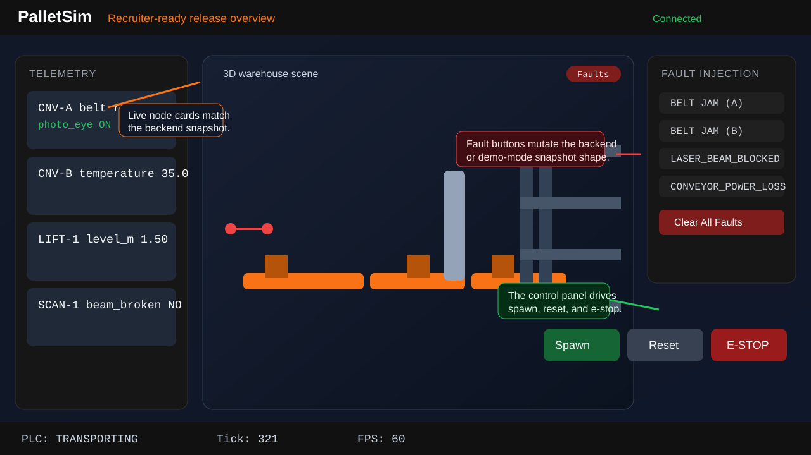

# Pallet Movement Simulator

Recruiter-ready warehouse simulator release with a Python control backend, a React/Three.js live UI, and smoke-testable local and Docker workflows.

GitHub Pages demo: https://jonasamidu.github.io/pallet-simulator/
This deploy is frontend-only and runs the built-in demo mode because GitHub Pages does not host the backend process.



## Architecture

The backend is a single-process asyncio simulator in `backend/main.py`. It owns the in-memory plant model, exposes REST endpoints on `:8000`, and pushes public state snapshots over a WebSocket server on `:8765`.

The frontend is a Vite/React app in `frontend/`. `LiveSimulationApp` wires together the telemetry sidebar, Three.js warehouse scene, control panel, and fault panel. A shared Zustand store receives state snapshots either from the live WebSocket or from the built-in demo-mode generator used on `*.github.io`.

The Docker release shape mirrors local development: the backend container serves REST and WebSocket traffic, and the frontend container serves the built assets through nginx with `/api/*` and `/ws` proxying back to the backend service.

## State Machine

The PLC state machine implemented in `backend/models/plc.py` is:

```text
IDLE -> LOADING -> TRANSPORTING -> LIFTING -> STORING -> COMPLETE -> IDLE
```

`ESTOP` is an interrupt state entered whenever the safety scanner alarm is active. Clearing the scanner fault returns the PLC to `IDLE`.

## Public Protocol

### REST

`GET /api/health`
Returns `503` while the first tick has not been published, then `200` with `{status, tick, plc_state}`.

`GET /api/state`
Returns the latest public snapshot.

`POST /api/pallet/spawn`
Accepts `{"weight_kg": number, "target_slot": "SLOT-r-c"}`. `target_slot` is optional; the backend allocates the first free slot when omitted.

`POST /api/reset`
Clears pallets, faults, rack occupancy, and node state, then returns `{"status": "reset"}`.

`POST /api/fault/inject`
Accepts `{"fault_type": string, "node_id": string|null}`. Node-scoped shorthands such as `BELT_JAM_CNV_A` are normalized to `BELT_JAM` plus `CNV-A`.

`POST /api/fault/clear`
Accepts either `{}` to clear every fault or `{"fault_type": string}` to clear one.

### WebSocket

Clients connect to `/ws`. The server immediately sends the latest public snapshot if one exists, then streams a fresh snapshot every tick at roughly `60 Hz`.

Snapshot shape:

```json
{
  "tick": 321,
  "timestamp": 118360.247021,
  "plc_state": "TRANSPORTING",
  "pallets": [
    {
      "id": "PLT-ABC123",
      "position": [2.45, 0.0, 1.0],
      "velocity": [0.0, 0.0, 0.0],
      "state": "moving",
      "on_node": "CNV-A",
      "weight_kg": 125.0,
      "target_slot": "SLOT-2-1"
    }
  ],
  "nodes": {
    "CNV-A": {
      "type": "conveyor",
      "belt_rpm": 4.77,
      "photo_eye": true,
      "temperature_c": 35.0,
      "position_mm": 250
    }
  },
  "slots": [
    {
      "id": "SLOT-0-0",
      "occupied": false,
      "pallet_id": null,
      "row": 0,
      "col": 0,
      "position": [6.0, 0.0, 2.0]
    }
  ],
  "faults_active": [],
  "alarms": []
}
```

`timestamp` is the asyncio loop clock in seconds, not a wall-clock ISO timestamp.

Command messages accepted over the socket:

```json
{"type":"spawn","weight_kg":125.0,"target_slot":"SLOT-2-1","command_id":"spawn-1"}
{"type":"reset","command_id":"reset-1"}
{"type":"inject_fault","fault_type":"LASER_BEAM_BLOCKED","command_id":"inject_fault-1"}
{"type":"clear_faults","fault_type":"BELT_JAM","command_id":"clear_faults-1"}
```

Every command is acknowledged with either `command_result` or `command_error`.

## Verification

### Clean clone setup

```bash
git clone https://github.com/JonasAmidu/pallet-simulator.git
cd pallet-simulator
python3 -m venv .venv
. .venv/bin/activate
python -m pip install --upgrade pip
pip install -r backend/requirements.txt
cd frontend
npm ci
cd ..
```

### Backend and frontend checks

```bash
python -m unittest discover -s backend/tests -v
cd frontend && npm test && npm run build && cd ..
./scripts/smoke-local.sh
./scripts/check-generated-files.sh
```

### Docker verification

```bash
docker compose up --build -d
curl http://127.0.0.1:8000/api/health
curl http://127.0.0.1:8080/healthz
curl http://127.0.0.1:8080/api/health
./scripts/smoke-compose.sh
```

## Trade-Offs

- The simulator is intentionally in-memory and single-process. That keeps startup and testing simple, but there is no persistence, authentication, or multi-user coordination.
- Fault injection over HTTP updates backend state immediately, while the frontend relies on the next WebSocket tick to display the change. This keeps the public state model single-sourced at the backend snapshot layer.
- The GitHub Pages deployment optimizes for recruiter accessibility by shipping a zero-backend demo mode, not a live control stack.

## Limitations

- Only the backend contract tests and frontend interaction/build checks are automated in CI; there is no full browser end-to-end suite.
- The public timestamp is monotonic process time, which is useful for relative ordering but not for audit logs.
- The model is intentionally simplified: the rack, conveyors, and lift expose only the sensors and transitions currently used by the UI and tests.

## Project Structure

```text
backend/
  main.py                 asyncio simulator entry point and HTTP/WebSocket surface
  models/                 PLC, rack, lift, scanner, conveyor, pallet models
  faults/                 fault parsing and application
  api/websocket.py        broadcast and command-ack transport
frontend/
  src/LiveSimulationApp.jsx
  src/components/         telemetry, warehouse scene, controls, faults
  src/simulation/         socket client, demo mode, shared store
scripts/
  smoke-local.sh          local backend + frontend verification
  smoke-compose.sh        Docker Compose verification
  check-generated-files.sh
```
